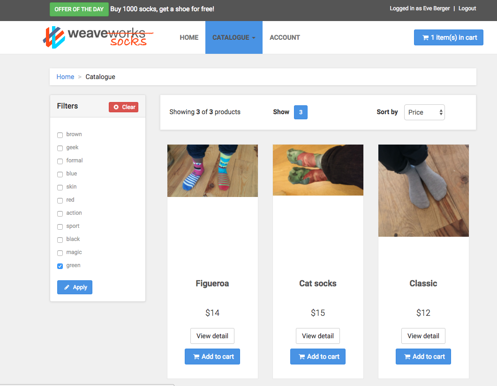
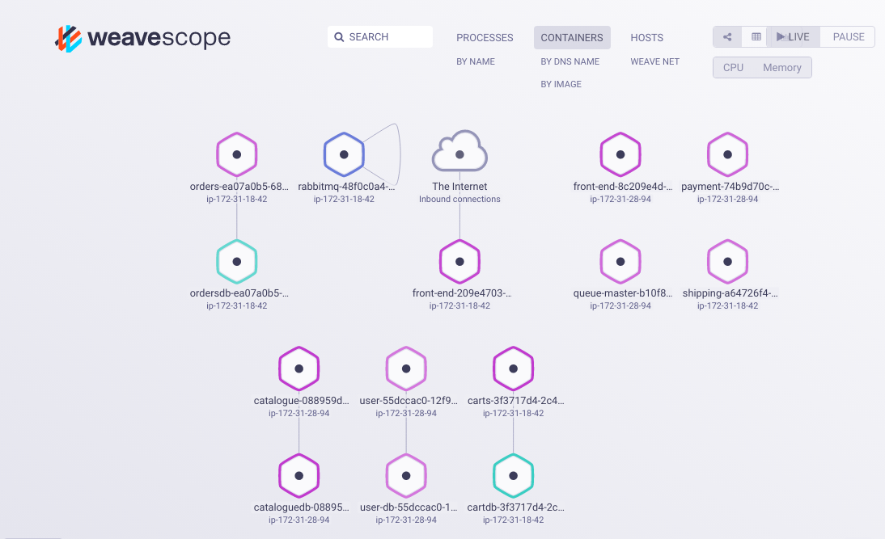
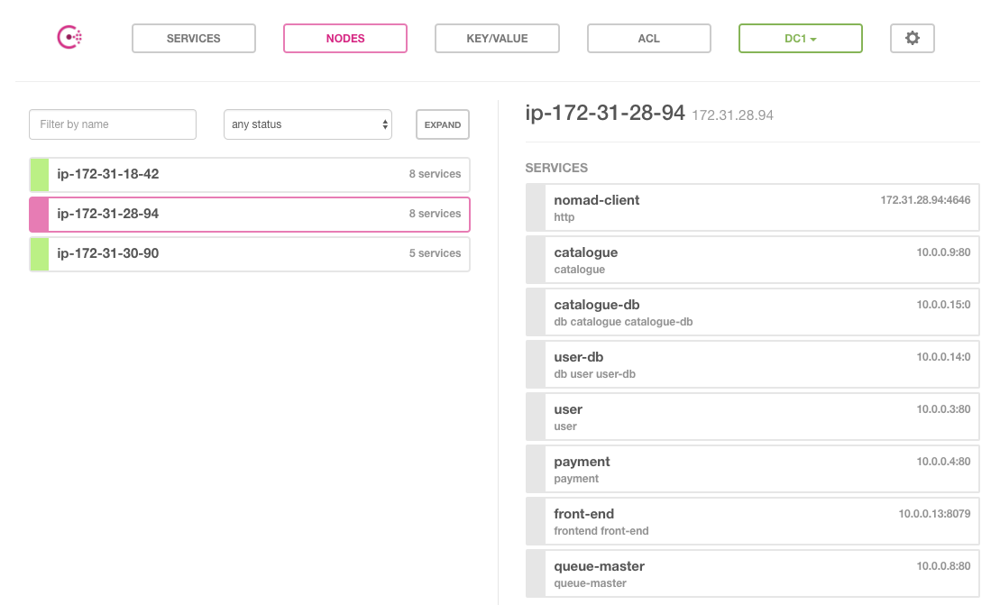

# Instructions for Deploying and Using the Sock Shop Demo
The Sock Shop Microservices Demo consists of 13 microservices which provide the customer-facing part of an e-commerce application. These services are written in several languages, including node.js, Java, and Go, and use RabbitMQ, 1 MySQL and 3 MongoDB databases. The demo is deployable on many platforms including Docker, Kubernetes, Amazon ECS, Mesos, Apcera, and Nomad.

You can learn more about the demo at the [Sock Shop](https://microservices-demo.github.io/) website which also includes links to all the source code and Docker images used by the demo.

The instructions below describe how you can deploy the Sock Shop microservices to AWS using [Nomad](https://www.nomadproject.io/) and [Consul](https://www.consul.io). Additionally, [Packer](https://www.packer.io) is used to build the AWS AMI, [Terraform](https://www.terraform.io) is used to provision the AWS infrastructure, and [Vault](https://www.vaultproject.io) is used to dynamically generate  AWS credentials to Terraform and a root password for one of the Sock Shop databases.

In our case, most of the Sock Shop microservices will be launched in Docker containers, using Nomad's Docker Driver, but one will be launched with Nomad's exec driver that can launch arbitrary commands.  Consul will be used for service discovery.

You'll want to clone this repository to your local machine with the command `git clone https://github.com/rberlind/nomad-consul-demo.git`

## Prerequisites
In order to deploy the Sock Shop demo to AWS, you will need an AWS account. You will also need to know your AWS access and secret access [keys](http://docs.aws.amazon.com/general/latest/gr/aws-sec-cred-types.html#access-keys-and-secret-access-keys). You'll also need a [key pair](http://docs.aws.amazon.com/AWSEC2/latest/UserGuide/EC2-key-pairs.html) from your AWS account. Of course, you'll also want to clone or download this repository to your laptop. In a terminal session, you would use `git clone https://github.com/rberlind/hashicorp-demo.git`.

You will need to download and install Packer and Terraform locally from [Packer Downloads](https://www.packer.io/downloads.html) and [Terraform Downloads](https://www.terraform.io/downloads.html) respectively. This demo was built and tested with Packer 1.2.1 and Terraform 0.11.4.

You will also need a Vault server that is accessible from your AWS account.  Ideally, you would run it in your AWS account. You can download Vault from [Vault Downloads](https://www.vaultproject.io/downloads.html). This demo was built and tested with Vault 0.9.5.

## Configure your Vault Server for the Demo
We assume you have installed, initialized, and unsealed your Vault server and can run `vault` commands against it. We have provided a script to automate the rest of the configuration of the Vault server needed for this demo, but you still need to manually initialize and unseal Vault if you have just deployed a new Vault server to use with this demo.  If that is the case, please do the following two steps on your Vault server:

### Initialize and Unseal your Vault Server if needed
1. Initialize your Vault server with `vault operator init -key-shares=1 -key-threshold=1`. Be sure to save your unseal key and root token.
1. Unseal your AWS Vault with `vault operator unseal`, providing your unseal key when prompted.

The rest of the Vault server configuration can be automated by running the [setup_vault.sh](./vault/setup_vault.sh) script after setting some environment variables:
1. `export AWS_ACCESS_KEY_ID=<your_aws_key>`
1. `export AWS_SECRET_ACCESS_KEY=<your_secret_key>`
1. `export VAULT_ADDR=<vault_address_with_port>`
1. `export VAULT_TOKEN=<vault_token>`
replacing \<your_aws_key\> and \<your_secret_key\> with AWS keys that can create other keys, \<vault_address_with_port\> with the URL for your Vault server including the port, and \<vault_token\> with a Vault token for your server.

We document all the steps below for those who would rather configure Vault manually.

### Configure AWS secrets engine on your Vault server
Instead of letting the setup_vault.sh script configure the AWS secrets engine, you could run the following commands from the vault directory, replacing \<your_key\> and \<your_secret_key\> below with your actual AWS keys.

```
vault secrets enable -path=aws-tf aws
vault write aws-tf/config/root \
 access_key=<your_key> \
 secret_key=<your_secret_key>
vault write aws-tf/config/lease lease=1h lease_max=24h
vault write aws-tf/roles/deploy policy=@aws-policy.json
```

If you want, test that you can dynamically generate AWS credentials by running `vault read aws/creds/deploy`.  This will return an access key and secret key usable for 1 hour.

### Configure SSH Secrets Engine on your Vault server
We're actually using the Vault SSH Secret Backend to generate the root user's password for the catalogue-db database and passing that into the catalogue-db Docker container via an environment variable. Here are the steps that the script does to set this up:

```
vault secrets enable -path=ssh-nomad ssh
vault write ssh-nomad/roles/otp_nomad key_type=otp default_user=root cidr_list=172.17.0.0/24
vault policy write ssh_policy ssh_policy.hcl
```

### Configure Vault to Generate Tokens for Nomad
In order for Nomad to fetch an SSH secret from Vault and use it as a password for the catalogue-db database, we need to set up some Vault policies. We import these into our Vault server with these commands:

```
vault policy write nomad-server nomad-server-policy.hcl
vault write auth/token/roles/nomad-cluster @nomad-cluster-role.json
```

## Provisioning AWS EC2 instances with Packer and Terraform
You can now use Packer and Terraform to provision your AWS EC2 instances. Terraform has already been configured to retrieve AWS credentials from your Vault server which has been configured to dynamically generate short-lived AWS keys for Terraform.

I've already used Packer to create a public Amazon Machine Image (AMI), ami-36f43e4b, which you can use as the basis for your EC2 instances. This AMI only exists in the AWS us-east-1 region. If you want to create a similar AMI in a different region or if you make any changes to any of the files in the shared directory, you will need to create your own AMI with Packer. This is very simple. Starting from the home directory, do the following (being sure to specify the region in packer.json if different from us-east-1):
```
cd aws/packer
packer build packer.json
cd ..
```
Be sure to note the AMI ID of your new AMI and to enter this as the value of the ami variable in the terraform.tfvars file under the aws directory. Save that file.  Also edit [delay-vault-aws](./aws/delay-vault-aws) to echo the AWS region you are running in if it is not us-east-1.

Before using Terraform, you need to use one of your AWS EC2 key pairs or [create](http://docs.aws.amazon.com/AWSEC2/latest/UserGuide/EC2-key-pairs.html#having-EC2-create-your-key-pair) a new one. Please download your private key and copy it to the aws directory to make connecting to your EC2 instances easier.  Be sure to specify the name of your key in the value for the "key_name" variable in terraform.tfvars under the aws directory. You should also set the variable owner_tag_value to your name or e-mail and then save that file before continuing.

Additionally, you need to set two environment variables so that Terraform can connect to your Vault server and request dynamically generated AWS keys.  In particular, set `VAULT_ADDR` to something like `http://<address>:<port>` (using https if you have enabled TLS for your Vault server).  I use http://ec2-54-215-103-114.us-west-1.compute.amazonaws.com:8200.  Set VAULT_TOKEN to a Vault token on your server that is allowed to use the AWS secrets and SSH engines. The actual commands to set these on Mac OS X or Linux are `export VAULT_ADDR=http://<address>:<port>` and `export VAULT_TOKEN=<token>`.

You also need to generate a Vault token for Nomad by running
`vault token create -policy nomad-server -period 72h -orphan | sed -e '1,2d' | sed -e '2,6d' | sed 's/ //g' | sed 's/token//'`. Edit the terraform.tfvars file and replace "TOKEN_FOR_NOMAD" with this token.

Now, you're ready to use Terraform to provision your EC2 instances.  The current configuration creates 1 Server instance running Nomad and Consul servers and 2 Client instances running Nomad and Consul clients. Your Sock Shop apps will be deployed by Nomad to the Client instances.

1. Run `terraform init` to initialize your Terraform configuration.
1. Run `terraform plan` to validate your Terraform configuration. You should see a message at the end saying that Terraform found 7 objects to add, 0 to chnage, and 0 to destroy.
1. Run `terraform apply` to provision your infrastructure. When this finishes, you should see a message giving the public and private IP addresses for all 3 instances.  Write these down for later reference. In your AWS console, you should be able to see all 3 instances under EC2 Instances. If you were already on that screen, you'll need to refresh it.

## Connecting to your EC2 instances
From a directory containing your private EC2 key pair, you can connect to your Nomad server with `ssh -i <key> ubuntu@<server_public_ip>`, replacing \<key\> with your actual private key file (ending in ".pem") and \<server_public_ip\> with the public IP of your server instance.

After connecting, if you run the `pwd` command, you will see that you are in the /home/ubuntu directory. If you run the `ls` command, you should see the file sockshop.nomad.

Please do connect to your server instance before continuing. You might also want to connect to one of your client instances too, using one of the public client IP addresses.


## Verification Steps
Verify that Nomad is running with `ps -ef | grep nomad`. You should see "/usr/local/bin/nomad agent -config=/etc/nomad.d/nomad.hcl".

You can verify that the sockshop Docker network was created with `docker network ls`. If you ssh-ed to one of your client instances, run this there too.

You could also verify that Weave Net and Weave Scope are running with `ps -ef | grep weave` and `ps -ef | grep scope`.

## Launching the Sock Shop application with Nomad
Launching the Sock Shop microservices with Nomad is very easy.  Just run:
```
nomad run sockshop.nomad
```
You can check the status of the sockshop job by running `nomad status sockshop`.  Please do this a few times until all of the task groups are running.

## Using the Sock Shop application
You should now be able to access the Sock Shop UI with a browser on your laptop.  Just point your browser against http://<client_ip>, replacing \<client_ip\> with either of the client instance public IP addresses.

You can login to the Sock Shop as "Eve_Berger" with password "eve".  You can then browse through the catalogue, add some socks to your shopping cart, checkout, and view your order.



## Checking the Sock Shop Services with Weave Scope and the Consul UI
You can use Weave Scope to see all the Docker containers that are running on your 2 client instances. Point your browser to http://<client_ip>:4040, replacing \<client_ip\> with either of the client instance public IP addresses. You can zoom in and out.  You can also make various selections such as only seeing application containers, only seeing running containers, viewing a graph indicating how the containers are communicating with each other, or viewing a table. You can select containers and even enter shells for them.



You can access the Consul UI by pointing your browser to http://<client_ip>:8500, replacing \<client_ip\> with either of the client instance public IP addresses. You can verify that all of the Sock Shop microservices are registered with Consul and easily determine which of the client instances the different services are running on.  Note that the current configuration runs 2 instances of front-end (the UI) and 1 instance of all the other Sock Shop microservices.


